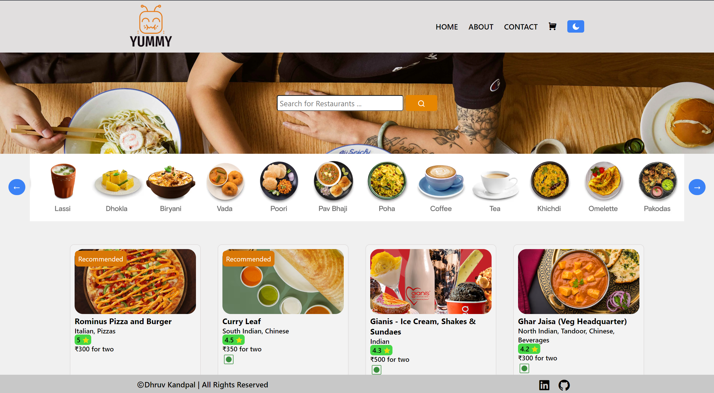

# Food Delivery Website

A food ordering application built using React, Redux Toolkit, and Tailwind CSS, integrating real-time data from the Swiggy API.

## Live Demo

Check out the live demo of the application [here](https://your-food-delivery-app-link.com).

## Key Features

- **Live Data Fetching:** Real-time updates and data fetching from Swiggy API to display restaurants, current menu items, and prices.
- **Custom Hook:** Created a custom hook to check if the user is online or offline, enhancing reliability.
- **Cart Functionality:** Seamless addition and removal of items for a smooth ordering experience.
- **Infinite Scrolling:** Continuous loading of restaurant listings as the user scrolls through the app.
- **Promoted Labels:** Highlighted recommended restaurants using Higher Order Components.
- **Shimmer Effect:** Enhanced user experience with loading placeholders during data fetching.
- **Performance Optimization:** Achieved high performance with a Google Lighthouse rating of 99, leveraging Vite as a bundler and optimizing code.
- **Responsive Design:** Fully responsive design ensuring a seamless experience across devices.
- **Light Mode/Dark Mode:** User-friendly interface that adapts to user preferences.

## Screenshots

### Home Page


### Restaurant Menu


## Installation

1. Clone the repository
    ```sh
    git clone https://github.com/DHRUVKANDPAL/Food-Delivery-App.git
    ```
2. Install dependencies
    ```sh
    npm install
    ```
3. Run the development server
    ```sh
    npm run dev
    ```
4. Open the app in your preferred web browser at `http://localhost:5173`.

## Usage

- Browse through restaurants and their menus.
- Add items to the cart and proceed to checkout.
- Explore recommended restaurants and new arrivals.

## Technologies Used

- **React**
- **Redux Toolkit**
- **Tailwind CSS**
- **Swiggy API**

